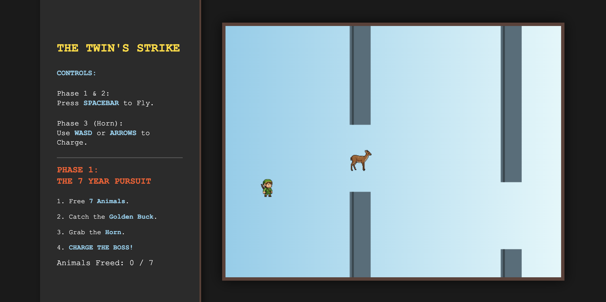

<a name="readme-top"></a>

[![MIT License][license-shield]][license-url]

<!-- ABOUT THE PROJECT -->
## About The Project
The Twin's Strike is a mythologically-inspired browser game that reimagines the story of the Iroquois Creation myth.

<!-- GETTING STARTED -->
## Getting Started

This is how to get the game up and running on your system.

### Installation

1. Clone the repo
   ```sh
   git clone https://github.com/r1chardlin/creation-myth.git
   ```
2. Open src/index.html in your web browser

<!-- Gameplay EXAMPLES -->
## Gameplay

  <a href="https://github.com/forrestcai35/wukong-jump">
    
  </a>

<!-- LICENSE -->
## License

Distributed under the MIT License. See `LICENSE.txt` for more information.


<!-- CONTACT -->
## Contact

Project Link: https://github.com/r1chardlin/creation-myth

<p align="right">(<a href="#readme-top">back to top</a>)</p>

<!-- MARKDOWN LINKS & IMAGES -->
[license-shield]: https://img.shields.io/badge/MIT-red?style=for-the-badge&label=LICENSE
